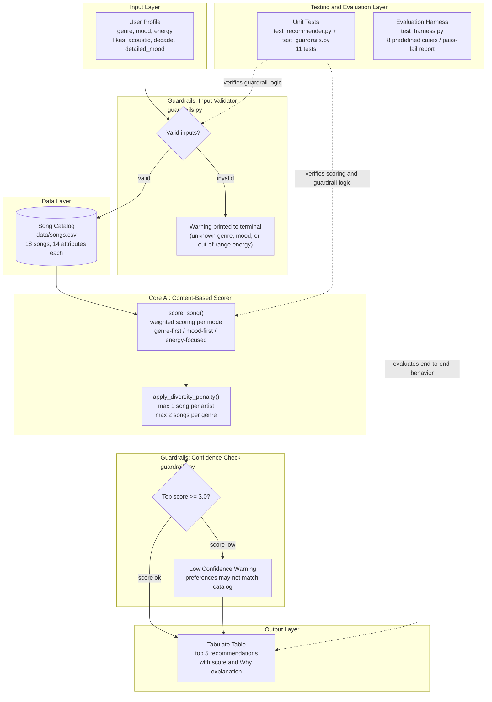

# VibeFinder 2.0 - Applied AI Music Recommender

## Base Project

This project extends **VibeFinder 1.0**, originally built for Module 3 of the AI110 course
([original repo](https://github.com/Phyvlik/ai110-module3show-musicrecommendersimulation-starter)).
The original system accepted a user's preferred genre, mood, energy level, and acoustic taste,
then scored an 18-song catalog using a weighted formula and returned the top 5 matches with
score explanations. It demonstrated how content-based filtering works and where it fails.

---

## Title and Summary

**VibeFinder 2.0** is a Python-based music recommendation system that extends the original
content-based filtering prototype into a more reliable and testable applied AI system.

The system takes a user profile (genre, mood, energy level, acoustic preference, decade, and
detailed mood), scores every song in the catalog using a weighted algorithm, applies a diversity
filter to avoid repetitive results, and runs guardrails at both input and output to catch bad
data and low-confidence recommendations before they reach the user. An automated evaluation
harness then verifies the system behaves consistently across 8 predefined test cases.

This matters because recommendation systems make decisions that shape what people hear, watch,
and read. Understanding how the weights, data, and guardrails interact is essential for building
AI systems that are both functional and trustworthy.

---

## System Architecture



> Diagram source also saved in [assets/architecture.md](assets/architecture.md).

**How data moves through the system:**

1. A user profile is passed to the input guardrail, which checks that genre and mood are
   recognized values and that energy is between 0.0 and 1.0.
2. If valid, every song in `data/songs.csv` is scored using the weighted formula.
3. The diversity filter re-ranks results to limit songs from the same artist or genre.
4. The output guardrail checks the top score. If it falls below 3.0, it warns the user
   that their preferences may not match the catalog.
5. Results are printed as a formatted table with scores and explanations.
6. Separately, the evaluation harness and unit tests verify the system produces correct
   and consistent results across a fixed set of inputs.

---

## Setup Instructions

**Requirements:** Python 3.9 or later.

1. Clone the repository:

   ```bash
   git clone https://github.com/Phyvlik/applied-ai-system-project.git
   cd applied-ai-system-project
   ```

2. (Optional) Create and activate a virtual environment:

   ```bash
   python -m venv .venv
   source .venv/bin/activate      # Mac or Linux
   .venv\Scripts\activate         # Windows
   ```

3. Install dependencies:

   ```bash
   pip install -r requirements.txt
   ```

4. Run the recommender:

   ```bash
   python -m src.main
   ```

5. Run the unit tests:

   ```bash
   pytest
   ```

6. Run the evaluation harness:

   ```bash
   python -m tests.test_harness
   ```

---

## Sample Interactions

Each profile is run across three scoring modes. Below are three representative examples.

### Profile 1: High-Energy Pop

**Input:**
```python
{
    "genre": "pop",
    "mood": "happy",
    "energy": 0.9,
    "likes_acoustic": False,
    "detailed_mood": "euphoric",
    "preferred_decade": "2020s"
}
```

**Output (genre-first mode):**


Top result is Sunrise City (pop, happy, energy 0.82) with score 6.70. Genre and mood both
match, energy is close to the target, and the 2020s decade preference adds a small bonus.

---

### Profile 2: Chill Lofi

**Input:**
```python
{
    "genre": "lofi",
    "mood": "chill",
    "energy": 0.38,
    "likes_acoustic": True,
    "detailed_mood": "mellow",
    "preferred_decade": "2020s",
    "prefers_instrumental": True
}
```

**Output (genre-first mode):**


Top two results are Library Rain and Midnight Coding, both lofi and chill with high
acousticness. The acoustic bonus and instrumental preference combine to push these
above other lofi tracks. Scores cluster tightly around 6.9 to 7.8.

---

### Profile 3: Edge Case - Conflicting Preferences

**Input:**
```python
{
    "genre": "ambient",
    "mood": "hype",
    "energy": 0.92,
    "likes_acoustic": True,
    "avoid_explicit": True
}
```

**Output (genre-first mode):**


Guardrail output: no input errors (ambient and hype are both valid), but the top result
is Spacewalk Thoughts with energy 0.28 - the opposite of the 0.92 target. This happens
because the genre weight (3.0) dominates all other signals when a rare genre matches.
The system behaves correctly by its own rules; the rules just do not handle contradictory
preferences well.

---

## Design Decisions

**Why content-based filtering?**
The original project goal was to show how recommendation algorithms work transparently.
Content-based filtering makes every scoring step inspectable: you can see exactly why a
song scored 4.5 instead of 3.2. Collaborative filtering (used by Spotify) would require
real listening data, which the project does not have.

**Why weighted scoring instead of a machine learning model?**
A trained model would require a labeled dataset of user preferences and song ratings.
For an 18-song catalog, a weighted formula is more appropriate and easier to reason about.
The trade-off is that the weights are static judgment calls, not learned from data.

**Why three scoring modes?**
Users listen to music for different reasons. Someone choosing workout music cares most
about energy. Someone choosing background music for studying cares most about mood. The
three modes (genre-first, mood-first, energy-focused) let the system serve different
use cases without changing the underlying catalog.

**Why guardrails instead of crashing on bad input?**
Silent failures are harder to debug than visible warnings. Printing a guardrail message
when energy is 1.8 is more useful than returning wrong results with no explanation.
The confidence check at output serves the same purpose: if the top score is below 3.0,
the user should know the results are unreliable before acting on them.

**Trade-off: genre weight dominance**
Setting genre weight to 3.0 makes the system intuitive for most users but breaks badly
when someone's preferred genre is rare in the catalog. A lower weight reduces the
filter-bubble effect but makes results feel less relevant for common genres. There is
no single correct weight; it depends on the catalog size and user base.

---

## Testing Summary

**What worked:**

- Content-based scoring produces consistent, explainable results. The evaluation harness
  confirms 8/8 test cases pass, including genre matching, diversity enforcement, and
  guardrail triggering.
- The diversity penalty works as intended: no artist appears more than once and no genre
  appears more than twice in the top 5.
- The input guardrail correctly catches unknown genres (e.g., "polka"), unknown moods
  (e.g., "melancholy"), and energy values outside 0.0 to 1.0.
- The confidence check correctly triggers for the edge case profile where the top score
  falls below the threshold.

**What did not work as expected:**

- The edge case profile (ambient genre, hype mood, energy 0.92) exposes a fundamental
  flaw: the genre weight overrides energy and mood when a rare genre matches. The system
  returns a quiet ambient track for a user who wants loud, hype music.
- The Intense Rock profile surfaces Gym Hero (pop) above Iron Curtain (metal) because
  valence proximity favors the pop track. A rock user expects metal before pop.
- With only 18 songs, genres like blues, classical, and folk produce one real match and
  four filler results regardless of how well the scoring logic works.

**What was learned:**

The biggest lesson is that algorithm correctness and result quality are not the same
thing. The scoring math is always correct; the results are only good when the weights
and catalog match the user's actual situation. Testing revealed this gap clearly.

---

## Reflection

VibeFinder 2.0 showed that extending a prototype into a reliable system requires
more engineering work than the original feature itself. The guardrails, test harness,
and evaluation script took as much thought as the scoring algorithm, and they are
what make the system trustworthy rather than just functional.

The most important AI insight from this project: confidence is not the same as
correctness. The edge case profile returned results with high internal consistency
but completely wrong behavior for the user. Real recommendation systems face this
same problem at scale. Adding reliability mechanisms - guardrails, evaluation loops,
and structured testing - is what separates a prototype from a production system.

For a full breakdown of biases, evaluation results, and AI collaboration notes, see
the [Model Card](model_card.md).

---

## File Structure

```
applied-ai-system-project/
    src/
        main.py            - CLI runner, integrates all components
        recommender.py     - Content-based scoring and diversity filter
        guardrails.py      - Input validation and output confidence check
    tests/
        test_recommender.py  - Unit tests for scoring logic
        test_guardrails.py   - Unit tests for guardrails
        test_harness.py      - Evaluation harness with 8 predefined test cases
    data/
        songs.csv          - 18-song catalog with 14 attributes per song
    assets/
        architecture.md    - Mermaid source for the system diagram
        phase4_*.png       - Terminal output screenshots
    model_card.md          - Algorithm summary, biases, and AI collaboration notes
    requirements.txt       - Python dependencies
```

---

## Limitations

- Catalog of 18 songs means rare-genre users get poor results regardless of scoring quality
- Genre weight (3.0) is strong enough to override energy and mood for rare genres
- No "sad" mood in the dataset; users wanting melancholic music get zero mood-match points
- System has no memory and cannot learn from user feedback or skips
- Valence scoring can produce counter-intuitive results when genre and mood do not match

For a full breakdown, see the [Model Card](model_card.md).
