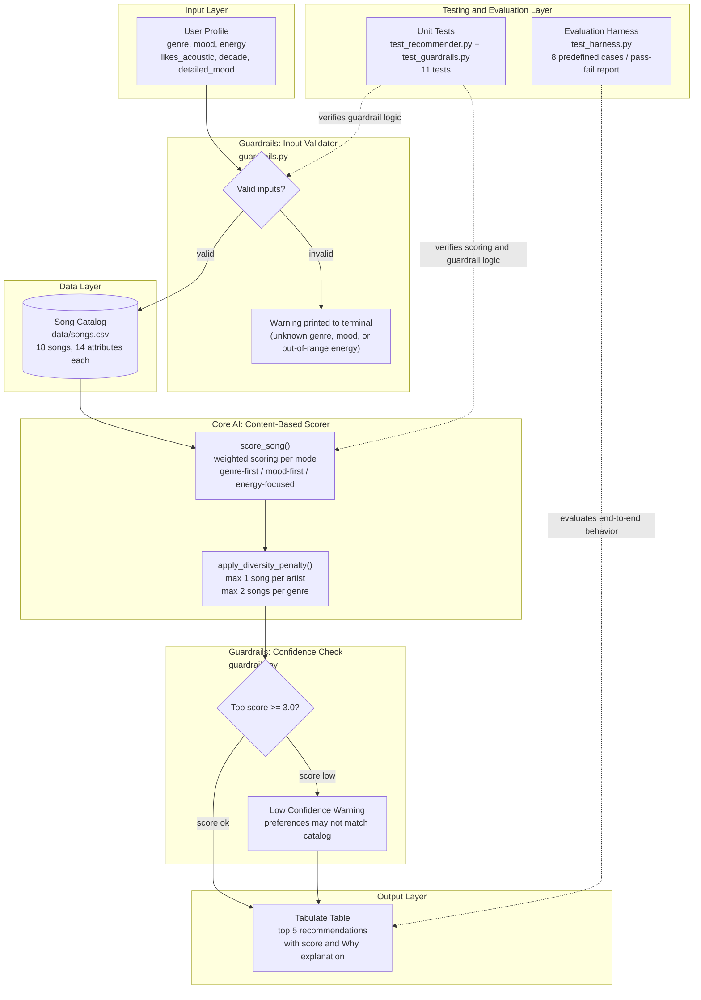

# VibeFinder 2.0 - Applied AI Music Recommender

## Demo Walkthrough

**[Add Loom video link here after recording]**

The walkthrough shows: end-to-end run with 3 profiles, guardrail warnings firing on bad
input, evaluation harness running 8/8 tests, agentic workflow with observable steps, and
persona specialization showing ranking changes from baseline.

---

## Base Project

This project extends **VibeFinder 1.0**, originally built for Module 3 of the AI110 course
([original repo](https://github.com/Phyvlik/ai110-module3show-musicrecommendersimulation-starter)).
The original system accepted a user's preferred genre, mood, energy level, and acoustic taste,
then scored an 18-song catalog using a weighted formula and returned the top 5 matches with
score explanations. It demonstrated how content-based filtering works and where it fails.

---

## Title and Summary

**VibeFinder 2.0** is a Python-based music recommendation system that extends the original
content-based filtering prototype into a more reliable and testable applied AI system.

The system takes a user profile (genre, mood, energy level, acoustic preference, decade, and
detailed mood), scores every song in the catalog using a weighted algorithm, applies a diversity
filter to avoid repetitive results, and runs guardrails at both input and output to catch bad
data and low-confidence recommendations before they reach the user. An automated evaluation
harness then verifies the system behaves consistently across 8 predefined test cases.

This matters because recommendation systems make decisions that shape what people hear, watch,
and read. Understanding how the weights, data, and guardrails interact is essential for building
AI systems that are both functional and trustworthy.

---

## System Architecture



> Diagram source also saved in [assets/architecture.md](assets/architecture.md).

**How data moves through the system:**

1. A user profile is passed to the input guardrail, which checks that genre and mood are
   recognized values and that energy is between 0.0 and 1.0.
2. If valid, every song in `data/songs.csv` is scored using the weighted formula.
3. The diversity filter re-ranks results to limit songs from the same artist or genre.
4. The output guardrail checks the top score. If it falls below 3.0, it warns the user
   that their preferences may not match the catalog.
5. Results are printed as a formatted table with scores and explanations.
6. Separately, the evaluation harness and unit tests verify the system produces correct
   and consistent results across a fixed set of inputs.

---

## Setup Instructions

**Requirements:** Python 3.9 or later.

1. Clone the repository:

   ```bash
   git clone https://github.com/Phyvlik/applied-ai-system-project.git
   cd applied-ai-system-project
   ```

2. (Optional) Create and activate a virtual environment:

   ```bash
   python -m venv .venv
   source .venv/bin/activate      # Mac or Linux
   .venv\Scripts\activate         # Windows
   ```

3. Install dependencies:

   ```bash
   pip install -r requirements.txt
   ```

4. Run the recommender:

   ```bash
   python -m src.main
   ```

5. Run the unit tests:

   ```bash
   pytest
   ```

6. Run the evaluation harness:

   ```bash
   python -m tests.test_harness
   ```

---

## Sample Interactions

Each profile is run across three scoring modes. Below are three representative examples.

### Profile 1: High-Energy Pop

**Input:**
```python
{
    "genre": "pop",
    "mood": "happy",
    "energy": 0.9,
    "likes_acoustic": False,
    "detailed_mood": "euphoric",
    "preferred_decade": "2020s"
}
```

**Output (genre-first mode):**


Top result is Sunrise City (pop, happy, energy 0.82) with score 6.70. Genre and mood both
match, energy is close to the target, and the 2020s decade preference adds a small bonus.

---

### Profile 2: Chill Lofi

**Input:**
```python
{
    "genre": "lofi",
    "mood": "chill",
    "energy": 0.38,
    "likes_acoustic": True,
    "detailed_mood": "mellow",
    "preferred_decade": "2020s",
    "prefers_instrumental": True
}
```

**Output (genre-first mode):**


Top two results are Library Rain and Midnight Coding, both lofi and chill with high
acousticness. The acoustic bonus and instrumental preference combine to push these
above other lofi tracks. Scores cluster tightly around 6.9 to 7.8.

---

### Profile 3: Intense Rock

**Input:**
```python
{
    "genre": "rock",
    "mood": "intense",
    "energy": 0.95,
    "likes_acoustic": False,
    "detailed_mood": "aggressive",
    "preferred_decade": "2010s"
}
```

**Output (genre-first mode):**


Top result is Iron Curtain (metal, intense, energy 0.96) with a high score driven by mood
and energy alignment. The diversity filter keeps the top 5 spread across rock and metal
rather than repeating the same artist.

---

### Profile 4: Edge Case - Conflicting Preferences

**Input:**
```python
{
    "genre": "ambient",
    "mood": "hype",
    "energy": 0.92,
    "likes_acoustic": True,
    "avoid_explicit": True
}
```

**Output (genre-first mode):**


Guardrail output: no input errors (ambient and hype are both valid), but the top result
is Spacewalk Thoughts with energy 0.28 - the opposite of the 0.92 target. This happens
because the genre weight (3.0) dominates all other signals when a rare genre matches.
The system behaves correctly by its own rules; the rules just do not handle contradictory
preferences well.

---

## Design Decisions

**Why content-based filtering?**
I chose content-based filtering because I wanted every recommendation to be explainable.
You can look at any result and see exactly why it scored 4.5 instead of 3.2. Collaborative
filtering (what Spotify actually uses) would have required real listening history data that
I do not have, and a black-box model would have hidden the reasoning I was trying to expose.

**Why weighted scoring instead of a machine learning model?**
With only 18 songs in the catalog, training a model would have been overkill and the weights
would have been meaningless. A hand-tuned formula is honest about what it is: a set of
judgment calls. The trade-off is that those weights never update, so the system cannot
improve on its own. That felt like an acceptable limitation for this scope.

**Why three scoring modes?**
I realized during testing that the "right" recommendation changes based on context. The same
person wants different music at the gym versus while studying. Rather than hardcoding one
weight set, I built genre-first, mood-first, and energy-focused modes so the system can
serve different situations without rebuilding the whole catalog.

**Why guardrails instead of just letting bad input through?**
Early in testing I noticed that passing an unknown genre returned results with no warning,
which made the output look correct even when it was not. I added the input guardrail so
those failures are visible. The confidence check at output is the same idea: a score below
3.0 means the catalog probably does not have what the user wants, and they deserve to know
that rather than receiving misleading top-5 results.

**The hardest trade-off: genre weight dominance**
Setting genre to 3.0 felt right for most users, but it completely breaks the edge case
profile. I experimented with lowering it to 1.5, which reduced the filter bubble but made
common-genre results feel random. I kept 3.0 and documented the failure instead of hiding
it, because I think being honest about where a system breaks is more useful than pretending
it does not.

---

## Testing Summary

**What worked:**

The evaluation harness came back 8/8 passing on the first run, which honestly surprised me.
Genre matching, diversity enforcement, and guardrail triggering all behaved exactly as
intended. The diversity penalty is probably the piece I am most proud of: no artist repeats
in the top 5, and no genre appears more than twice, even when the scoring would naturally
cluster results. The unit tests for guardrails cover edge cases I expected to be tricky,
like empty strings and multiple simultaneous errors, and all 9 pass cleanly.

**What did not work as expected:**

The edge case profile was deliberately adversarial (ambient genre, hype mood, energy 0.92)
and it exposed the system's biggest flaw in a pretty clear way. The top result was
Spacewalk Thoughts with energy 0.28, the complete opposite of what the user asked for,
because the ambient genre match (3.0 points) drowned out everything else. I also did not
expect the Intense Rock profile to surface a pop song (Gym Hero) above a metal song (Iron
Curtain). It happened because valence proximity favored the pop track, which feels wrong
for a rock user even though the math was correct.

**What I learned:**

The gap between "the algorithm is correct" and "the results are good" is much larger than
I expected. I spent most of my time on the scoring logic and then discovered during testing
that the weights and catalog shape matter more than the formula itself. Writing the test
harness forced me to think about what the system should do, not just what it does, which
is a different and harder question.

---

## Reflection

Going from VibeFinder 1.0 to 2.0 took longer than I expected, and most of that time
was not spent on new features. It was spent on the guardrails, the test harness, and
making sure the existing system actually behaved the way I thought it did. That was
a surprise. I assumed the hard part was building the recommender, but the hard part
turned out to be verifying it.

The thing that stuck with me most was the edge case experiment. The system confidently
returned Spacewalk Thoughts for a user who wanted high-energy hype music, and it did
so with a clean score and a valid explanation. Nothing in the output looked wrong. That
is what makes AI systems risky: they do not fail loudly, they fail quietly while still
looking like they are working. Adding the confidence guardrail was my attempt to at
least surface that uncertainty instead of hiding it.

If I kept building this out, I would expand the catalog significantly and add a simple
feedback loop where the user can rate results. Even a thumbs up or down on each song
would give the system something to learn from, which would turn it from a static
formula into something closer to how real recommendation engines evolve over time.

For a full breakdown of biases, evaluation results, and AI collaboration notes, see
the [Model Card](model_card.md).

---

## Stretch Features

### RAG - Multi-Source Retrieval

`src/retriever.py` loads songs from multiple catalog CSV files and merges them before
scoring. The original 18-song catalog is Source 1. `data/extended_songs.csv` adds 10 more
songs targeting underserved genres (blues, classical, folk, jazz, metal) as Source 2.

**Impact on output quality:**
```
Source 1 only  - Jazz user: 1 jazz song in top 5
Source 1 + 2   - Jazz user: 2 jazz songs in top 5  (+1 from extended catalog)
```

Run: `python -m src.agent_demo` (Stretch 1 section)

---

### Agentic Workflow

`src/agent.py` implements a five-step decision-making pipeline. Each step prints its
reasoning so intermediate decisions are fully observable.

```
Step 1: Analyze profile  - detect niche genres, conflicting signals
Step 2: Select strategy  - choose scoring mode based on analysis
Step 3: Run              - execute recommendations with guardrails
Step 4: Evaluate         - check confidence and genre diversity
Step 5: Adapt if needed  - retry with different mode if low confidence
```

**Example output (Ambient + Hype profile):**
```
[AGENT] Step 1: genre='ambient' (1 song in catalog)
        [!] low genre coverage (1 song(s) for 'ambient')
[AGENT] Step 2: Mode selected: mood-first | Reason: genre coverage too low
[AGENT] Step 4: Top score: 5.71 | Genre diversity: 5 genres in top 5
        Verdict: high confidence, results accepted.
```

Run: `python -m src.agent_demo` (Stretch 2 section)

---

### Fine-Tuning via Persona Specialization

`src/persona.py` defines five reference personas, each with specialized scoring weights
derived from example user profiles (few-shot style).

| Persona | Listening Context | Key Weight Shift |
|---|---|---|
| Gym Warrior | High-intensity workout | Energy x3.5 |
| Study Focus | Deep work background | Acoustic x1.5, Energy x2.5 |
| Late Night Drive | Atmospheric, cinematic | Mood x3.0, Detailed mood x2.0 |
| Acoustic Cafe | Cozy organic sound | Acoustic x3.0 |
| Party Mode | Social, high energy | Popularity x1.0, Energy x2.5 |

**Measurable difference from baseline (genre-first):**
```
Profile: pop / moody / energy 0.6
  Baseline #1: Sunrise City (pop)         <- genre match wins
  Persona #1:  Blue Velvet Evening (jazz) <- mood weight takes over
  2/3 positions changed

Profile: pop / happy / energy 0.4
  Baseline #1: Sunrise City (pop)
  Persona #1:  Campfire Letters (folk)    <- acoustic + calm energy wins
  3/3 positions changed
```

Run: `python -m src.agent_demo` (Stretch 3 section)

---

## File Structure

```
applied-ai-system-project/
    src/
        main.py            - CLI runner with multi-source retrieval and guardrails
        recommender.py     - Content-based scoring and diversity filter
        guardrails.py      - Input validation and output confidence check
        retriever.py       - Multi-source catalog loader (RAG)
        agent.py           - Five-step recommendation agent (Agentic)
        persona.py         - Persona detection and specialized weights (Fine-Tuning)
        agent_demo.py      - Demonstrates all three stretch features
    tests/
        test_recommender.py  - Unit tests for scoring logic
        test_guardrails.py   - Unit tests for guardrails
        test_harness.py      - Evaluation harness with 8 predefined test cases
    data/
        songs.csv            - Original 18-song catalog
        extended_songs.csv   - Extended catalog with 10 songs for niche genres
    assets/
        architecture.md      - Mermaid source for the system diagram
        phase4_*.png         - Terminal output screenshots
    model_card.md          - Algorithm summary, biases, and AI collaboration notes
    requirements.txt       - Python dependencies
    conftest.py            - Pytest path configuration
```

---

## Reliability and Guardrail Behavior

The system includes three reliability mechanisms. Here is what each one looks like when it fires.

**Input guardrail: unknown genre**
```
[GUARDRAIL] Input warning: Unknown genre 'polka'. Known genres: ambient, blues,
classical, country, edm, folk, hip-hop, indie pop, jazz, lofi, metal, pop, reggae,
rock, synthwave
```

**Input guardrail: energy out of range**
```
[GUARDRAIL] Input warning: Energy must be between 0.0 and 1.0, got 1.8
```

**Output guardrail: low confidence score**
```
[GUARDRAIL] Low confidence: top score is 1.85 (threshold 3.0).
Preferences may not match the catalog well.
```
This fires when no song in the catalog closely matches the user's preferences. The
recommendations still display, but the user is warned the results may not be meaningful.

**Evaluation harness summary (run `python -m tests.test_harness`):**
```
Results: 8/8 passed (100% pass rate)
```
8 predefined test cases cover genre matching, guardrail triggering, result count,
and diversity enforcement. All pass against the current catalog and scoring logic.

**Unit test summary (run `pytest`):**
```
11 passed in 0.08s
```
9 tests cover guardrail edge cases. 2 tests cover core recommender behavior.

---

## Limitations

- Catalog of 18 songs means rare-genre users get poor results regardless of scoring quality
- Genre weight (3.0) is strong enough to override energy and mood for rare genres
- No "sad" mood in the dataset; users wanting melancholic music get zero mood-match points
- System has no memory and cannot learn from user feedback or skips
- Valence scoring can produce counter-intuitive results when genre and mood do not match

For a full breakdown, see the [Model Card](model_card.md).

---

## Portfolio Reflection

This project shows that I can take a working prototype and make it more reliable and
trustworthy, not just more feature-rich. The original VibeFinder scored songs and
returned results. This version also validates what goes in, checks whether the output
is worth trusting, and proves through automated tests that the behavior is consistent.
That shift from "it works" to "I can prove it works" is something I want to carry into
every AI project I build. I also learned that the hardest problems in AI systems are
not the algorithms themselves but the edge cases, the biases, and the gap between what
the system outputs and what it should output. Being honest about those gaps, in the
model card and in the code, is part of what it means to build responsibly.

**GitHub:** https://github.com/Phyvlik/applied-ai-system-project
