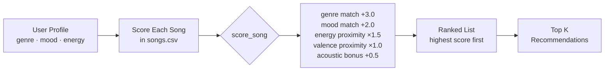
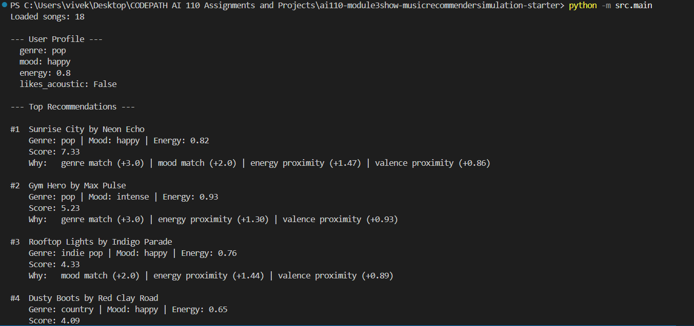
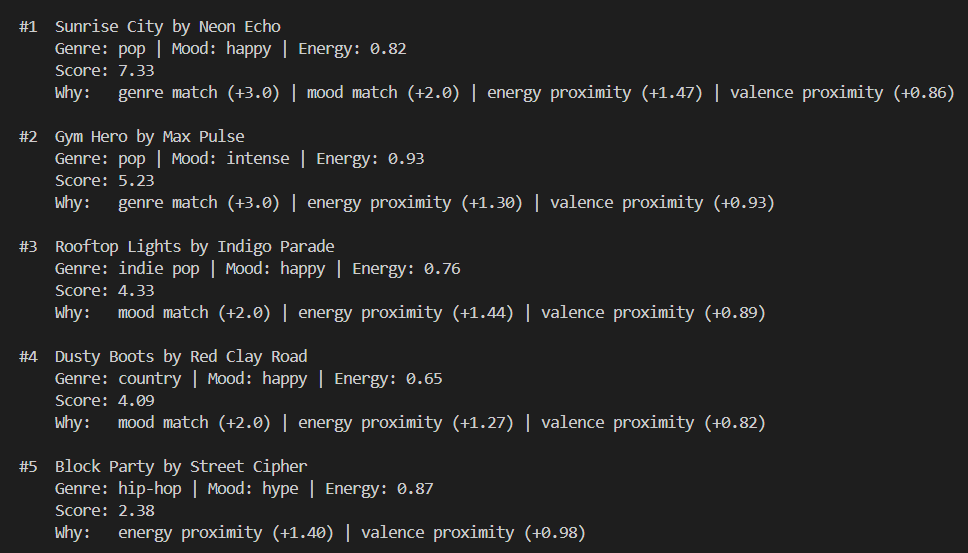
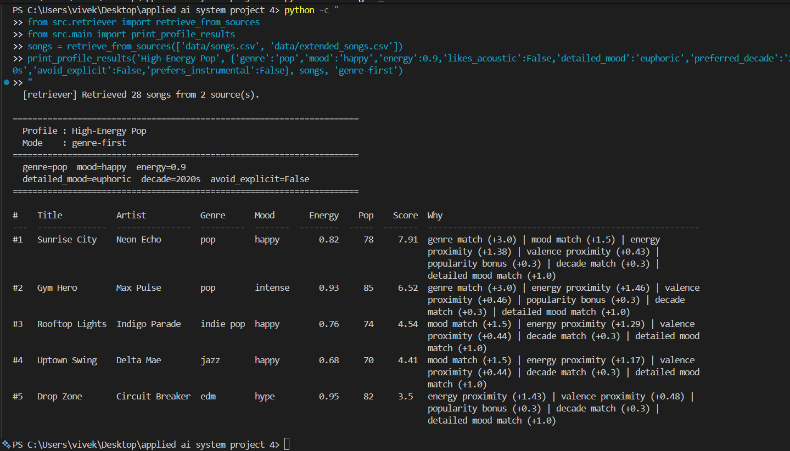
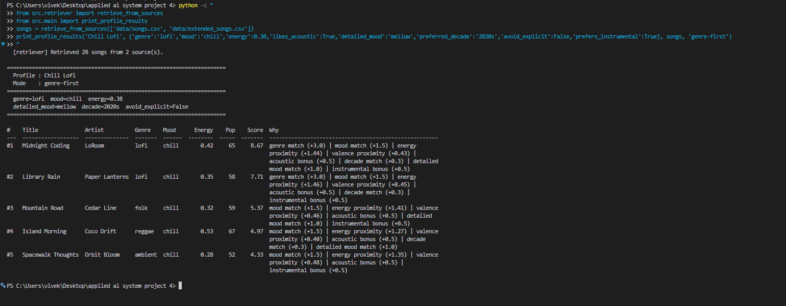
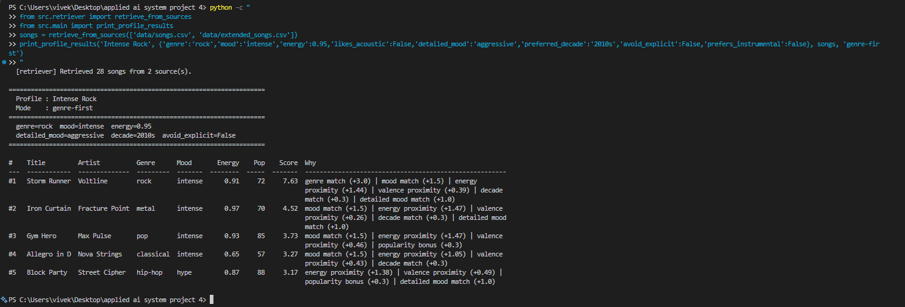
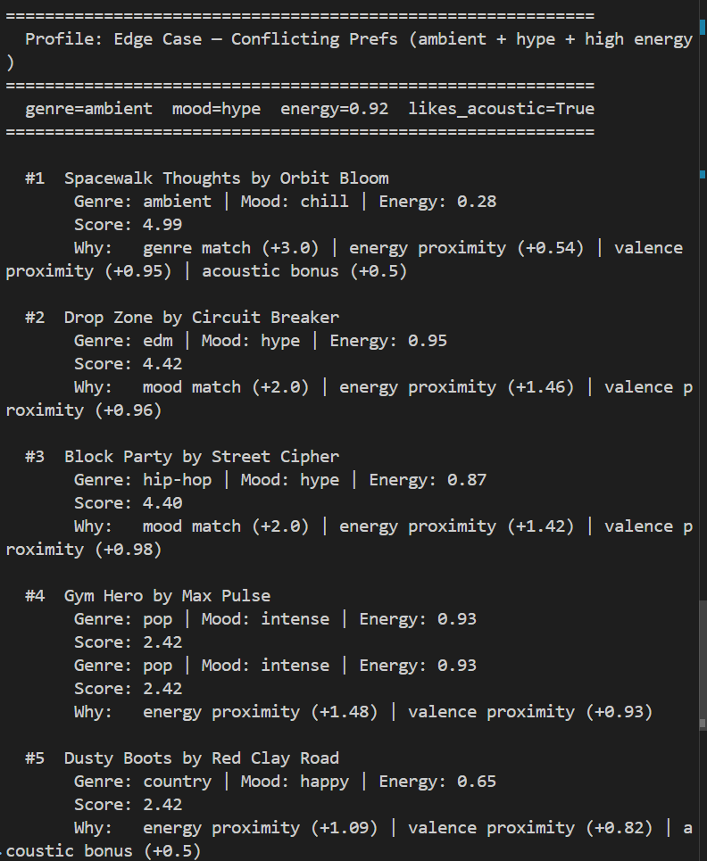

# 🎵 Music Recommender Simulation

## Project Summary

In this project you will build and explain a small music recommender system.

Your goal is to:

- Represent songs and a user "taste profile" as data
- Design a scoring rule that turns that data into recommendations
- Evaluate what your system gets right and wrong
- Reflect on how this mirrors real world AI recommenders

Replace this paragraph with your own summary of what your version does.

---

## How The System Works

Real-world platforms like Spotify and YouTube predict what you'll enjoy by analyzing patterns — either from what songs you and similar users have listened to (collaborative filtering), or from the attributes of the songs themselves (content-based filtering). At scale, these systems process millions of data points per second, combining listening history, skip behavior, time of day, and audio features to rank an enormous catalog down to a short list. This simulation focuses on the content-based approach: it compares the attributes of each song directly against a user's taste profile and assigns a relevance score, then surfaces the top matches.

This version prioritizes **genre** and **mood** as the strongest signals of musical taste, uses **energy** and **valence** to fine-tune matches based on intensity and emotional positivity, and factors in **acousticness** for users who prefer organic or produced sounds. Songs are scored individually, then ranked highest-to-lowest to produce the final recommendation list.

**`Song` features used:**
- `genre` — categorical (e.g., pop, lofi, rock)
- `mood` — categorical (e.g., happy, chill, intense)
- `energy` — float 0.0–1.0, intensity of the track
- `valence` — float 0.0–1.0, musical positivity
- `acousticness` — float 0.0–1.0, acoustic vs. produced sound

**`UserProfile` fields used:**
- `favorite_genre` — the genre the user most prefers
- `favorite_mood` — the mood the user is looking for
- `target_energy` — the energy level the user wants (0.0–1.0)
- `likes_acoustic` — boolean preference for acoustic sound

---

## Example User Profile

```python
user_prefs = {
    "genre": "pop",
    "mood": "happy",
    "energy": 0.8,       # wants high-energy tracks
    "likes_acoustic": False
}
```

This profile can clearly differentiate between "intense rock" (wrong genre, wrong mood despite similar energy) and "chill lofi" (wrong genre, wrong mood, wrong energy) — both would score low. A happy pop track with high energy would score highest.

---

## Algorithm Recipe

For each song in the catalog, compute a relevance score:

| Rule | Points |
|---|---|
| Genre matches `favorite_genre` | +3.0 |
| Mood matches `favorite_mood` | +2.0 |
| Energy proximity: `1 - abs(song.energy - target_energy)` × 1.5 | 0.0–1.5 |
| Valence proximity: `1 - abs(song.valence - target_valence)` × 1.0 | 0.0–1.0 |
| Acousticness bonus if `likes_acoustic=True` and `acousticness > 0.6` | +0.5 |

**Max possible score: ~8.0**

Genre is weighted highest (3.0) because it is the broadest filter of taste — a country fan is unlikely to enjoy metal regardless of mood. Mood is second (2.0) because it reflects what the user wants right now. Energy and valence use proximity scoring so a song that is *close* to the target scores better than one that is simply high or low.

**Data flow:**



---

## Known Biases in This Design

- **Genre lock-in:** A 3.0 weight on genre means a perfect mood+energy match in the wrong genre will never beat a mediocre same-genre song. Users with niche genres (classical, blues) will see fewer matches in a small catalog.
- **Filter bubble risk:** Running this repeatedly reinforces the same genre/mood cluster — the system never surprises the user with something outside their stated taste.
- **Catalog imbalance:** With 18 songs, some genres have only 1 entry, so users of those genres get almost no recommendations.
- **No behavioral signal:** The system treats a brand-new user and a long-time user identically — it has no memory of what was skipped or replayed.

---

## Getting Started

### Setup

1. Create a virtual environment (optional but recommended):

   ```bash
   python -m venv .venv
   source .venv/bin/activate      # Mac or Linux
   .venv\Scripts\activate         # Windows

2. Install dependencies

```bash
pip install -r requirements.txt
```

3. Run the app:

```bash
python -m src.main
```

### Running Tests

Run the starter tests with:

```bash
pytest
```

You can add more tests in `tests/test_recommender.py`.

---

## Terminal Output

### Phase 3 — Default Profile (pop / happy / 0.8 energy)




---

### Phase 4 — Stress Test: Multiple Profiles

**Profile 1: High-Energy Pop**



**Profile 2: Chill Lofi**



**Profile 3: Intense Rock**



**Profile 4: Edge Case — Conflicting Prefs (ambient + hype + high energy)**



---

## Experiments You Tried

**Weight Shift — Genre halved (3.0 → 1.5), Energy doubled (1.5 → 3.0):**
For the pop/happy profile, Rooftop Lights jumped from #3 to #2, overtaking Gym Hero. Rooftop Lights has energy 0.76 which is closer to the 0.9 target than Gym Hero's 0.93 (which overshoots). When energy matters more, proximity beats a genre match. Takeaway: weight choices are judgment calls, not facts.

**Edge Case — Conflicting prefs (ambient + hype + energy 0.92):**
Spacewalk Thoughts ranked #1 despite having energy 0.28 — opposite of the 0.92 target — purely because of the genre match (+3.0). This is the system's biggest failure mode: for rare genres, the genre weight dominates and ignores everything else.

**Intense Rock profile:**
Iron Curtain (metal, intense) ranked below Gym Hero (pop, intense) even though metal is closer to rock than pop. The reason: valence. Gym Hero's valence (0.77) is closer to the default 0.7 target than Iron Curtain's (0.21). This shows valence can produce counter-intuitive results when genre is absent.

---

## Limitations and Risks

Summarize some limitations of your recommender.

Examples:

- It only works on a tiny catalog
- It does not understand lyrics or language
- It might over favor one genre or mood

You will go deeper on this in your model card.

---

## Reflection

[**Full Model Card**](model_card.md)

Building VibeFinder showed that a recommendation system is just a set of weighted decisions — and the weights are judgment calls, not facts. The genre weight (3.0) made the system feel intuitive for pop and lofi users, but completely broke for the edge case profile where a quiet ambient track ranked #1 for a user who wanted high-energy hype music. The system was doing the math correctly; the math just didn't match reality.

The most important insight about bias: this system doesn't need malicious intent to be unfair. It over-serves pop and lofi users simply because those genres have the most songs in the catalog. Blues, classical, and folk users get one real match and four filler recommendations. That kind of imbalance shows up in real platforms too — niche genres and non-Western music are historically underrepresented in training data, which means the algorithm deprioritizes them not by choice but by default.


---

## 7. `model_card_template.md`

Combines reflection and model card framing from the Module 3 guidance. :contentReference[oaicite:2]{index=2}  

```markdown
# 🎧 Model Card - Music Recommender Simulation

## 1. Model Name

Give your recommender a name, for example:

> VibeFinder 1.0

---

## 2. Intended Use

- What is this system trying to do
- Who is it for

Example:

> This model suggests 3 to 5 songs from a small catalog based on a user's preferred genre, mood, and energy level. It is for classroom exploration only, not for real users.

---

## 3. How It Works (Short Explanation)

Describe your scoring logic in plain language.

- What features of each song does it consider
- What information about the user does it use
- How does it turn those into a number

Try to avoid code in this section, treat it like an explanation to a non programmer.

---

## 4. Data

Describe your dataset.

- How many songs are in `data/songs.csv`
- Did you add or remove any songs
- What kinds of genres or moods are represented
- Whose taste does this data mostly reflect

---

## 5. Strengths

Where does your recommender work well

You can think about:
- Situations where the top results "felt right"
- Particular user profiles it served well
- Simplicity or transparency benefits

---

## 6. Limitations and Bias

Where does your recommender struggle

Some prompts:
- Does it ignore some genres or moods
- Does it treat all users as if they have the same taste shape
- Is it biased toward high energy or one genre by default
- How could this be unfair if used in a real product

---

## 7. Evaluation

How did you check your system

Examples:
- You tried multiple user profiles and wrote down whether the results matched your expectations
- You compared your simulation to what a real app like Spotify or YouTube tends to recommend
- You wrote tests for your scoring logic

You do not need a numeric metric, but if you used one, explain what it measures.

---

## 8. Future Work

If you had more time, how would you improve this recommender

Examples:

- Add support for multiple users and "group vibe" recommendations
- Balance diversity of songs instead of always picking the closest match
- Use more features, like tempo ranges or lyric themes

---

## 9. Personal Reflection

A few sentences about what you learned:

- What surprised you about how your system behaved
- How did building this change how you think about real music recommenders
- Where do you think human judgment still matters, even if the model seems "smart"

