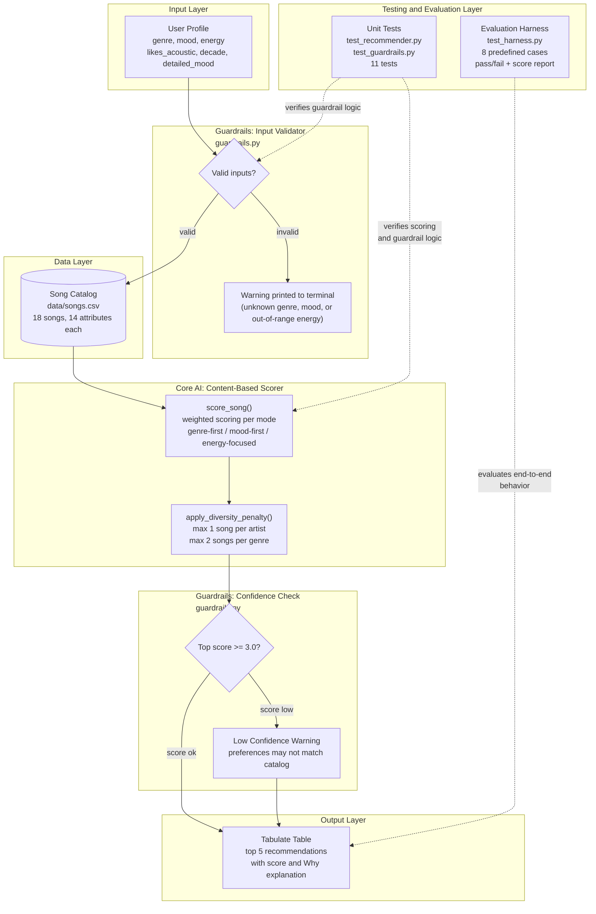

# VibeFinder System Architecture

```mermaid
flowchart TD
    subgraph INPUT["Input Layer"]
        A["User Profile\ngenre, mood, energy\nlikes_acoustic, decade, detailed_mood"]
    end

    subgraph GUARD_IN["Guardrails: Input Validator\nguardrails.py"]
        B{"Valid inputs?"}
        B1["Warning printed to terminal\n(unknown genre, mood, or out-of-range energy)"]
    end

    subgraph DATA["Data Layer"]
        C[("Song Catalog\ndata/songs.csv\n18 songs, 14 attributes each")]
    end

    subgraph CORE["Core AI: Content-Based Scorer\nrecommender.py"]
        D["score_song()\nweighted scoring per mode\ngenre-first / mood-first / energy-focused"]
        E["apply_diversity_penalty()\nmax 1 song per artist\nmax 2 songs per genre"]
    end

    subgraph GUARD_OUT["Guardrails: Confidence Check\nguardrails.py"]
        F{"Top score >= 3.0?"}
        F1["Low Confidence Warning\npreferences may not match catalog"]
    end

    subgraph OUTPUT["Output Layer"]
        G["Tabulate Table\ntop 5 recommendations\nwith score and Why explanation"]
    end

    subgraph TESTING["Testing and Evaluation Layer"]
        H["Unit Tests\ntest_recommender.py\ntest_guardrails.py\n11 tests"]
        I["Evaluation Harness\ntest_harness.py\n8 predefined cases\npass/fail + score report"]
    end

    A --> B
    B -->|invalid| B1
    B -->|valid| C
    C --> D
    D --> E
    E --> F
    F -->|score ok| G
    F -->|score low| F1
    F1 --> G
    H -. "verifies scoring\nand guardrail logic" .-> D
    H -. "verifies guardrail logic" .-> B
    I -. "evaluates end-to-end\nbehavior" .-> G
```
